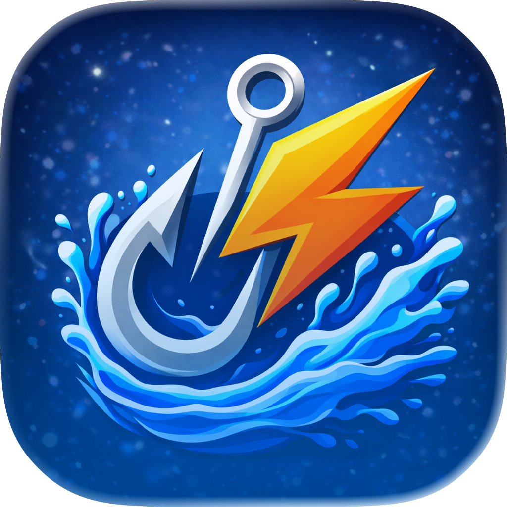

  
  
  # Catchly
  
  **Your moments. Your spots. Your bites.**
  
  Your personal fishing diary to capture every adventure and fish smarter through experience.
  
  

---

## 📱 About Catchly

Catchly is your digital companion for every fishing trip. Whether you're a casual angler or a passionate fishing enthusiast, Catchly helps you:

- 🎣 **Log your catches** – Record every fish with photos, species, size, weight, and location
- 🗺️ **Remember your spots** – Save your favorite fishing locations and build your personal fishing map
- 📊 **Track your progress** – Analyze your success and learn from every adventure
- 📅 **Organize adventures** – Document complete fishing trips with all the details that matter
- 🔒 **Privacy first** – All your data stays on your device – no cloud sync, no data sharing

## ✨ Features

- Beautiful, intuitive interface designed for anglers
- Photo documentation for every catch
- Detailed catch statistics
- Location tracking for fishing spots
- Weather conditions logging
- Completely offline – no internet required
- 100% privacy – your data never leaves your device

## 🐛 Feedback & Support

Found a bug or have a feature request? We'd love to hear from you!

- 💬 **Discussions:** Ask questions, share ideas, or connect with other anglers in our [GitHub Discussions](https://github.com/dominikamann/catchly.app/discussions)
- 🐛 **Bug Reports:** Report issues in the [Issues section](https://github.com/dominikamann/catchly.app/issues)

## 🌐 Website

Visit our [support page](https://dominikamann.github.io/catchly.app/) for more information and FAQs.

## 📄 Privacy

Catchly takes your privacy seriously. The app does not collect, store, or share any personal data with third parties. All your fishing data remains exclusively on your device.

For more details, see our [Privacy Policy](https://dominikamann.github.io/catchly.app/privacy.html).

---

  Made with ❤️ for anglers by anglers
  
  © 2025 Catchly – All rights reserved

